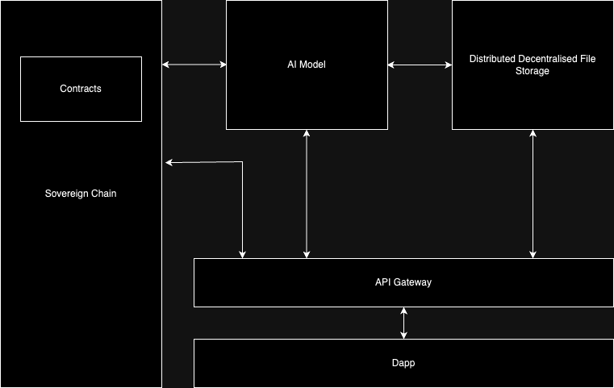

## Beautiful Health: Decentralised Patient-Centric Health Care Record and Decentralised AI Diagnostic Platform

### Abstract
Beautiful Health is a decentralised healthcare record system designed for the Multiverse X hackathon #ProofOfHack. It prioritises patient data privacy and control by leveraging an openEHR compliant framework built with Rust contracts on the Multiverse X blockchain. The system features an API gateway service that connects to a FastAPI Microservice running an AI diagnostic model capable of analysing chest radiographs. Beautiful Health aims to solve interoperability challenges, enhance data privacy, and provide seamless integration of advanced diagnostics, empowering patients and healthcare providers alike.

### Useful Links
1. Contract Address: erd1qqqqqqqqqqqqqpgq7d50l7gtdcp79hw2atjf42cem7up02avt73ssffcwt 
2. Devnet Explorer: https://devnet-explorer.multiversx.com/accounts/erd1qqqqqqqqqqqqqpgq7d50l7gtdcp79hw2atjf42cem7up02avt73ssffcwt
3. Dapp Address (In-Progress): https://contracts-xi.vercel.app/
4. Pistachio (fastAPI AI Analysis microservice): Deployment in progress, available for testing locally

### Introduction

#### Background
In the current healthcare landscape, data management is plagued by centralised systems that compromise patient privacy and control. These systems often face interoperability issues, making it difficult for healthcare providers to access and share patient information seamlessly.

#### Purpose
Beautiful Health addresses these issues by offering a decentralised patient-centric approach to healthcare data management. By decentralising records, patients regain control over their data, and interoperability is enhanced through standardised frameworks. Additionally, the integration of an AI model running on FastAPI ensures that advanced diagnostic capabilities are both secure and scalable. This innovative approach empowers patients and equips healthcare providers with powerful tools for improved diagnosis and treatment.

#### Scope
This ReadMe details the technical architecture and components of Beautiful Health, highlighting its innovative use of blockchain technology, API integration, and AI diagnostics.

### Problem Statement
1. Healthcare Data Privacy
Centralised healthcare systems store patient data in silos, increasing the risk of breaches and unauthorised access. Patients have limited control over their data, raising concerns about privacy and security.

2. Interoperability Challenges
Different healthcare providers use various systems and standards, creating significant barriers to effective data exchange. This fragmentation leads to inefficiencies and potential errors in patient care.

3. Patient Control
Traditional systems often do not provide patients with easy access to their own health records. Patients cannot easily share their data with providers or manage permissions for data access, leading to a lack of empowerment.

### Key Components
1. openEHR Compliant Framework: Ensures data consistency and interoperability across different healthcare systems.
2. Rust Contracts on Multiverse X Chain: Built using Rust contracts deployed on the Multiverse X blockchain, ensuring security, transparency, and immutability of health records.
3. API Gateway Service: Facilitates data access and integration with external systems, handling secure data retrieval and interaction with the Cartesi VM pod.
4. Pistachio: Hosts an AI diagnostic model capable of analysing chest radiographs, integrating advanced diagnostic capabilities directly into the decentralised framework.

The technical architecture of Beautiful Health is designed to ensure data privacy, interoperability, and advanced diagnostic capabilities through a decentralised framework. The system is composed of several key components:

### System Architecture Overview
1. Blockchain Layer: Built on the Multiverse X Devnet utilizing Rust contracts for secure storage and management of health records.
2. API Gateway Service: Handles authentication, authorization, and secure data transactions, ensuring only authorised entities can access or modify health records.
3. Diagnostic AI Model: The FastAPI microservice hosts the AI diagnostic model, leveraging computational capabilities to ensure scalability and robustness.

### Data Flow
1. Data Input: Patients enter their health data through a secure portal. This data is encrypted and submitted to the blockchain via the API gateway.
2. Data Storage: The encrypted health records are stored on the Multiverse X blockchain. Smart contracts manage access permissions and audit logs.
3. Data Retrieval: Authorised healthcare providers can request access to patient records through the API gateway. The gateway verifies their identity and permissions before retrieving the data from the blockchain.
4. AI Analysis: When a chest radiograph needs to be analysed, the image data is sent to the FastAPI Microservice. The AI model processes the image and returns the diagnostic results.
5. Result Storage: The diagnostic results are securely stored on the blockchain linked to the patient's record. Providers can access these results through the API gateway.

### Benefits and Use Cases

#### Patient Benefits
1. Full control over their health data with the ability to manage permissions and ensure their privacy.
2. Increased trust and engagement in their healthcare.
   
#### Healthcare Providers
1. Standardised health records enabling better collaboration and more informed decision-making.
2. Enhanced diagnostic capabilities through the integration of AI diagnostics.

#### AI Diagnostics
1. Early detection and diagnosis of conditions such as pneumonia and lung cancer, improving patient outcomes.

#### Real-World Use Cases
1. Securely share complete medical history with a new healthcare provider.
2. Integrate the AI diagnostic model into a hospital's radiology department.
3. Provide authorised healthcare providers access to health records while travelling abroad.

#### Conclusion
In a world where technology is rapidly transforming every aspect of our lives, Beautiful Health stands at the forefront of revolutionising healthcare. By harnessing the power of decentralisation, blockchain technology, and advanced AI diagnostics, we offer a vision where patients are the true custodians of their health data. Our system empowers individuals, ensuring that their private information remains secure while seamlessly integrating cutting-edge diagnostic tools that enhance the capabilities of healthcare providers.
Beautiful Health is not just a solution; it is a movement towards a more equitable, efficient, and transparent healthcare system. Imagine a world where your medical records are always at your fingertips, where you can share them securely with any healthcare provider, anywhere in the world, at any time. A world where advanced AI models assist doctors in making quicker, more accurate diagnoses, saving lives and improving health outcomes.
We believe in a future where technology serves humanity, fostering trust and collaboration across the healthcare ecosystem. Beautiful Health is a testament to what we can achieve when we prioritise privacy, interoperability, and innovation. It is an invitation to join us on this journey to create a healthcare system that truly cares for the individual, respects their privacy, and leverages the best of modern technology to enhance life.
As we look to the future, we see endless possibilities for growth and enhancement. We envision expanding our diagnostic capabilities, integrating more comprehensive health data, and fostering an ecosystem where innovation thrives. We invite developers, healthcare providers, and stakeholders to be part of this transformative journey.
Together, let’s build a world where health is beautiful, data is secure, and every individual has the power to take control of their health journey. Join us in making Beautiful Health a reality, and let’s pave the way for a brighter, healthier future for all.

### Roadmap

#### Phase 1: Initial Deployment (Hackathon Phase)
1. Blockchain Implementation: Deploy the core Rust contracts on the Multiverse X Devnet.
2. API Gateway Launch: Develop and launch the API gateway service.
3. AI Model Integration: Integrate the initial AI diagnostic model for chest radiograph analysis using FastAPI.

#### Phase 2: System Expansion (Q4 2024)
1. Integrate Cartesi VM for decentralised AI analysis.
2. User Onboarding: Launch a user-friendly portal for patients and healthcare providers.
3. Diagnostic Model Enhancements: Expand AI model capabilities.
4. Interoperability Improvements: Enhance the API gateway for broader interoperability.
   
#### Phase 3: Advanced Features (Q1 2025)
1. Predictive Analytics: Implement advanced predictive analytics.
2. Patient-Centric Tools: Develop tools for better health data management.
3. Test deploy on Sovereign Chain

Thanks you.
Akanimoh Osutuk

